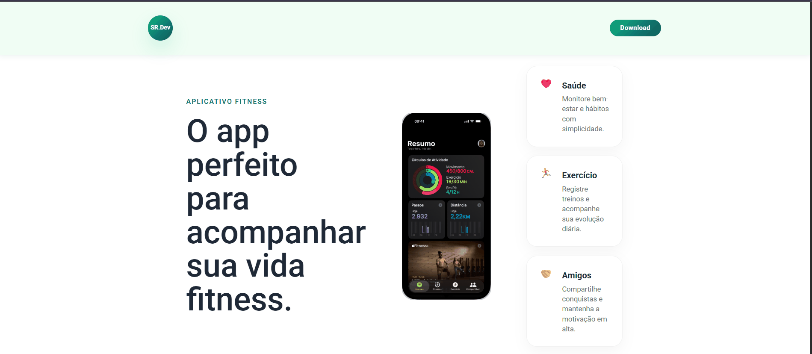

## 🚀 Sobre o Projeto

A **SR.Dev Fitness** é uma landing page desenvolvida com foco em conversão, experiência do usuário e responsividade.

O projeto apresenta um aplicativo fitness capaz de auxiliar usuários no acompanhamento de hábitos saudáveis, controle de metas, exercícios personalizados e interação com amigos.

### Objetivos

- Apresentar o aplicativo de forma clara e atrativa
- Destacar funcionalidades principais
- Incentivar o download do app
- Garantir excelente experiência em diferentes dispositivos

---

## 🛠️ Tecnologias Utilizadas


---

## ✨ Funcionalidades

✅ Hero Section moderna

✅ Apresentação das funcionalidades do aplicativo

✅ Seção de monitoramento de calorias

✅ Exercícios personalizados

✅ Compartilhamento com amigos

✅ Call To Action (CTA)

✅ Header e Footer personalizados

✅ Responsividade para:

- 📱 Smartphones
- 📱 Smartphones médios
- 📲 Tablets
- 💻 Desktop
- 🖥️ Telas widescreen

---

## 🎨 Identidade Visual

A identidade visual foi construída utilizando cores associadas à saúde, bem-estar e tecnologia:

- Verde Esmeralda
- Azul Petróleo
- Tons claros de verde para destaque de seções
- Layout minimalista e moderno

---

## 📂 Estrutura do Projeto

```bash
📁 landing-page-fitness
│
├── index.html
├── css/
│   └── style.css
│
├── assets/
│   ├── images/
│   ├── icons/
│   └── screenshots/
│
└── README.md
```

---

## ▶️ Como Executar

Clone o repositório:

```bash
git clone https://github.com/Silviareis1/-landing-page-fitness.git
```

Entre na pasta:

```bash
cd -landing-page-fitness
```

Abra o arquivo:

```bash
index.html
```

Ou utilize a extensão Live Server no VS Code.

---

## 📱 Responsividade

O projeto foi ajustado especificamente para:

| Dispositivo | Largura |
|------------|----------|
| Mobile Pequeno | até 425px |
| Mobile Médio | até 768px |
| Tablet | 768px - 1024px |
| Desktop | acima de 1024px |

Foram realizados ajustes específicos de:

- Tipografia
- Espaçamentos
- Cards
- Tamanho das imagens
- Footer
- CTA
- Layout das seções

---

## 🎥 Demonstração

<p align="center">
  
</p>


---

## 🌐 Projeto Online

🔗 https://silviareis1.github.io/-landing-page-fitness/

---

## 👩‍💻 Autora

### Silvia Reis

Estudante de Desenvolvimento Front-End

GitHub:
https://github.com/Silviareis1

---

## 📄 Licença

Projeto desenvolvido para fins educacionais e de prática em desenvolvimento Front-End.

---

<p align="center">
  Desenvolvido com 💚 por Silvia Reis
</p>
</p>

---

## 📸 Preview

<p align="center">
  
</p>

---

## 🌐 Projeto Online

🔗 https://silviareis1.github.io/-landing-page-fitness/

---

## 👩‍💻 Autora

### Silvia Reis

Estudante de Desenvolvimento Front-End

GitHub:
https://github.com/Silviareis1

---

## 📄 Licença

Projeto desenvolvido para fins educacionais e de prática em desenvolvimento Front-End.

---

<p align="center">
  Desenvolvido com 💚 por Silvia Reis
</p>