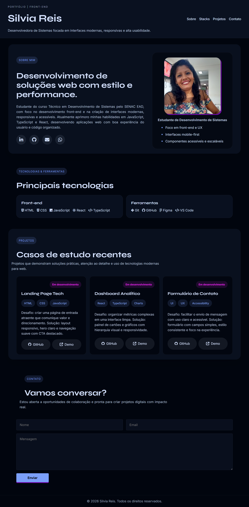

'# ✨ TrendsIT 2026 — Portfólio Silvia Reis

<p align="center">
  Um portfólio front-end moderno, responsivo e focado em identidade visual profissional, acessibilidade e experiência do usuário.
</p>

---

## 🚀 Sobre o Projeto

O **Portfolio do projeto TrendsIT 2026** representa minha identidade digital como desenvolvedora front-end, reunindo design moderno, organização visual e boas práticas de desenvolvimento web.

O projeto foi construído com foco em:

- 🎨 Interface moderna e profissional
- 📱 Layout responsivo para diferentes dispositivos
- ♿ Acessibilidade e usabilidade
- ⚡ Navegação simples e intuitiva
- 🧩 Estrutura limpa e escalável
- 🎯 Posicionamento técnico e visual consistente

---

# 🛠️ Tecnologias Utilizadas


---

# 🛠️ Funcionalidades

✅ Navegação clara entre seções  
✅ Hero section com posicionamento técnico  
✅ Cards modernos de projetos  
✅ Botões para GitHub e Demo  
✅ Layout totalmente responsivo  
✅ Formulário de contato acessível  
✅ Sistema visual baseado em Design System  
✅ Estrutura organizada e de fácil manutenção  

---

# 📂 Estrutura do Projeto

```bash
📁 trendsit-2026
│
├── index.html
├── style.css
│
├── assets
│   ├── img
│   │   └── screencapture.png
└── README.md
```

---

# ▶️ Como Executar Localmente

Clone o repositório:

```bash
git clone git@github.com:Silviareis1/portfolio-front-end-silvia-reis.git
```

Acesse a pasta do projeto:

```bash
cd portfolio-front-end-silvia-reis
```

Abra o arquivo `index.html` diretamente no navegador  
ou utilize uma extensão como **Live Server** no VS Code.

---

# 📱 Responsividade

O layout foi desenvolvido para se adaptar a diferentes tamanhos de tela, proporcionando uma experiência consistente em:

- Smartphones
- Tablets
- Notebooks
- Monitores widescreen

---

# 🌟 Objetivos do Projeto

Este portfólio foi criado para:

- Fortalecer presença digital
- Demonstrar habilidades front-end
- Aplicar conceitos modernos de UI/UX
- Consolidar práticas de HTML e CSS
- Criar uma base profissional para futuros projetos

---

# 📸 Preview

<p align="center">
  
</p>

---

# 👩‍💻 Autora

## Silvia Reis

Desenvolvedora Front-End em formação, focada em interfaces modernas, acessibilidade e experiências digitais intuitivas.

---

# 📄 Licença

Este projeto está sob a licença MIT.

---

<p align="center">
  Desenvolvido com 💙 por Silvia Reis
</p>'
tá certo os ajuste 


